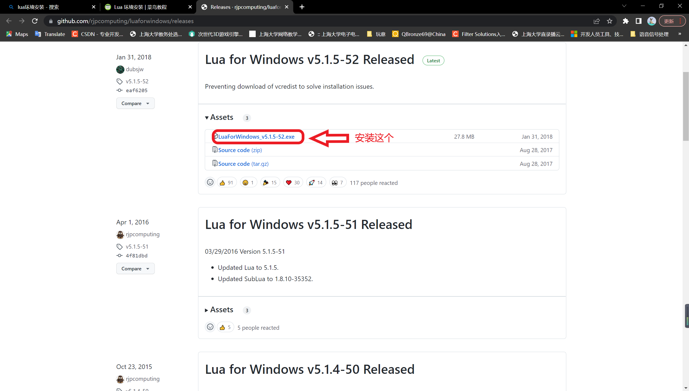

# 如何安装环境

## Windows

使用GitHub上的exe进行安装

Github 下载地址：[https://github.com/rjpcomputing/luaforwindows/releases](https://github.com/rjpcomputing/luaforwindows/releases "安装地址")

还可以使用VScode进行code runner的ExecutorMap的lua配置(编写lua.ece路径配置)完成编译，下载版本可选择binarylibrary版本免编译直接出配置。

### 参考文件

* [菜鸟编程网站：https://www.runoob.com/lua/lua-environment.html](https://www.runoob.com/lua/lua-environment.html "https://www.runoob.com/lua/lua-environment.html")
* Programming in Lua 2th
